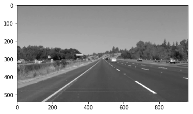
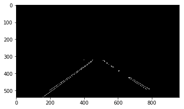
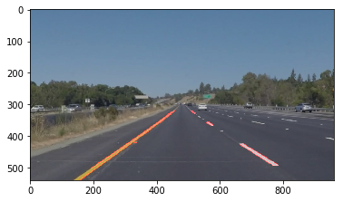
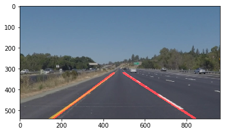

# **Finding Lane Lines on the Road** 

## Writeup Template

### You can use this file as a template for your writeup if you want to submit it as a markdown file. But feel free to use some other method and submit a pdf if you prefer.

---

**Finding Lane Lines on the Road**

The goals / steps of this project are the following:
* Make a pipeline that finds lane lines on the road
* Reflect on your work in a written report

---

### Reflection

### 1. Describe your pipeline. As part of the description, explain how you modified the draw_lines() function.

My pipeline consisted of 5 steps. 
First, I converted the images to grayscale, then I smoothened the image by applying Gassuan Blur (to reduce the noise) with kernel size of 5. 

Here is the image after Applying Gaussian Blur on the image shown before.

As a second step in the process I have applied Canny Edge detection on the image that resulted from the above step. Here I have given the threshold ranges of 50  to 150 for the edge graidients to be detected. Here is the resulting image that shows only the detected edges in white color and the rest if black.

In the above image the edges are detected only in certain part of the image. The third step in my pipeline is to find the area of interest for further processing. In this case of the image of the road, I approximated this to be a trapezoid shape with edges along the road.Here is the image after the area of interest applied on the canny edge detected image.

Here comes the important step in the pipeline that identifes the road segments and constructs the missing road segments. This fourth step involves passing the above image to HoughLines algorithm to find the lines that are identifed from the edges detected in before step. To get this the following arguments are supplied - rho:1, theta:pi/180, threshold:10, nim_length:10, max_line_gap:2. This step return bunch of lines with x and y co-ordinates. 

However some of the lanes on the road are partly painted and that resulted in breaks for the lines and in some cases doens't the lines properly. In order to draw a single line on the left and right lanes, I enhanced the existing draw_lines() function by adding the following as the fifth step
   - Not all line segments returned by Hough lines function doesn't belong to the lanes and some small line segments returned by Hough lines are with a different gradient/angle compared to the designated left/right lane in the image. For this reason I have added a step/filter to discard the lines that are less than 15 pixel length and/or having a slope that doesn't agree within 5% of the average gradient of all lines within the left/right lane. Once those lines are eliminated, I found end points for each left/right lanes. This logic is implemented in function: find_line_end_points().Here is the image that simply connects those end points 
   
 
   - However, if the line that is not pinted properly/or having breaks it doesn't show the liens connected on the image. For this reason I have implemented a logic to contruct the missing lines based on the existing small line segments. Use the existing gradient and y co-ordinate (it could be the top part or bottom part of the lane) to find the x co-ordinagte to draw the missing lines. This logic is implemented in function: draw_lines_enh(). Here is a final image that resulted after applying the enhanced draw_lines function.
   
    
   

As a last step in the pipeline, I have combined the original image and the houghlines formed in the step before to create an image the shows the lane marking with color RED super imposed on the image.

Resulting test output images https://github.com/rnaidu02/Udacity-Self-driving-Finding-Lanes/tree/master/test_images
Resulting test output videos https://github.com/rnaidu02/Udacity-Self-driving-Finding-Lanes/tree/master/test_videos

### 2. Identify potential shortcomings with your current pipeline

One potential shortcoming would be what would happen when the road part within the image changes (i.e. currently it is approximately half of the image but it could be different with a different recording). Currently my region of interest is fixed for half height and that is one limitation.

Another shortcoming I figured after testing the challenge video (with curved roads) is that this logic doesn't work with the curved lanes. IT works onlt if the lanes recorded are of a straight line. 

### 3. Suggest possible improvements to your pipeline

A possible improvement would be to find the region of interest based on the edges discovered after canny edges and dynamically figure out the regoi based on the edges max/min co-ordinates in two dimensional plane.

Another potential improvement could be to figure out how to detect the curved lanes. One of the paper I came across addressed this issue but need more time to look into and implement a solution.
